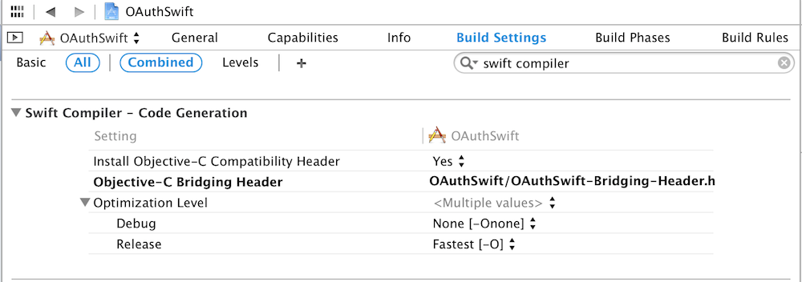
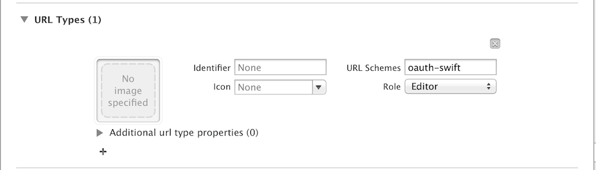
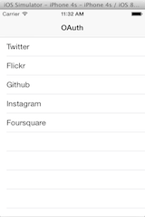
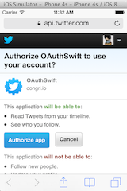
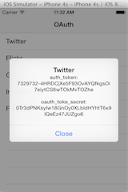

OAuthSwift
==========

Swift based OAuth library for iOS

### Support OAuth1.0, OAuth2.0

Twitter, Flickr, Github, Instagram, Foursquare. Fitbit, Withings, Linkedin, Dropbox etc

### OAuth pages

[Twitter](https://dev.twitter.com/docs/auth/oauth)  
[Flickr](https://www.flickr.com/services/api/auth.oauth.html)  
[Github](https://developer.github.com/v3/oauth)  
[Instagram](http://instagram.com/developer/authentication)  
[Foursquare](https://developer.foursquare.com/overview/auth)  
[Fitbit](https://wiki.fitbit.com/display/API/OAuth+Authentication+in+the+Fitbit+API)  
[Withings](http://oauth.withings.com/api)  
[Linkedin](https://developer.linkedin.com/documents/authentication)  
[Dropbox](https://www.dropbox.com/developers/core/docs)

### Installation

1. Add OAuthSwift as a [submodule](http://git-scm.com/docs/git-submodule) by opening the Terminal, `cd`-ing into your top-level project directory, and entering the command `git submodule add https://github.com/rjourde/OAuthSwift.git`
2. Open the `OAuthSwift` folder, and drag `OAuthSwift.xcodeproj` into the file navigator of your app project.
3. In Xcode, navigate to the target configuration window by clicking on the blue project icon, and selecting the application target under the "Targets" heading in the sidebar.
4. Ensure that the deployment target of OAuthSwift.framework matches that of the application target.
5. In the tab bar at the top of that window, open the "Build Phases" panel.
6. Expand the "Target Dependencies" group, and add `OAuthSwift.framework`.
7. Click on the `+` button at the top left of the panel and select "New Copy Files Phase". Rename this new phase to "Copy Frameworks", set the "Destination" to "Frameworks", and add `OAuthSwift.framework`.
8. In top-level OAuthSwift directory, create a new folder named `CommonCrypto`.
9. Open the `CommonCrypto` folder, and create a new file named `module.map`.
10. Open the `module.map` file, and add the following lines:
`module CommonCrypto [system] {
  header "/Applications/Xcode.app/Contents/Developer/Platforms/iPhoneSimulator.platform/Developer/SDKs/iPhoneSimulator8.1.sdk/usr/include/CommonCrypto/CommonCrypto.h"
  link "CommonCrypto"
  export *
}`
11. Open the "Build Settings" panel and set `<OAuthSwift_Path>/CommonCrypto` to "Import Paths".

---  

### Examples

```swift
// AppDelegate
func application(application: UIApplication!, openURL url: NSURL!, sourceApplication: String!, annotation: AnyObject!) -> Bool {
  if (url.host == "oauth-callback") {
    if (url.path!.hasPrefix("/twitter")){
      OAuth1.handleOpenURL(url)
    }
    if ( url.path!.hasPrefix("/github" )){
      OAuth2.handleOpenURL(url)
    }
  }
  return true
}

// OAuth1.0
let oauthswift = OAuth1(
    consumerKey:    "********",
    consumerSecret: "********",
    requestTokenUrl: "https://api.twitter.com/oauth/request_token",
    authorizeUrl:    "https://api.twitter.com/oauth/authorize",
    accessTokenUrl:  "https://api.twitter.com/oauth/access_token"
)
oauthswift.authorizeWithCallbackURL( NSURL(string: "oauth-swift://oauth-callback/twitter"), success: {
    credential, response in
    println(credential.oauth_token)
    println(credential.oauth_token_secret)
}, failure: failureHandler)

// OAuth2.0
let oauthswift = OAuth2(
    consumerKey:    "********",
    consumerSecret: "********",
    authorizeUrl:   "https://api.instagram.com/oauth/authorize",
    responseType:   "token"
)
oauthswift.authorizeWithCallbackURL( NSURL(string: "oauth-swift://oauth-callback/instagram"), scope: "likes+comments", state:"INSTAGRAM", success: {
    credential, response in
    println(credential.oauth_token)
}, failure: failureHandler)

```

### Setting Swift Compiler



### Setting URL Schemes



### Images




